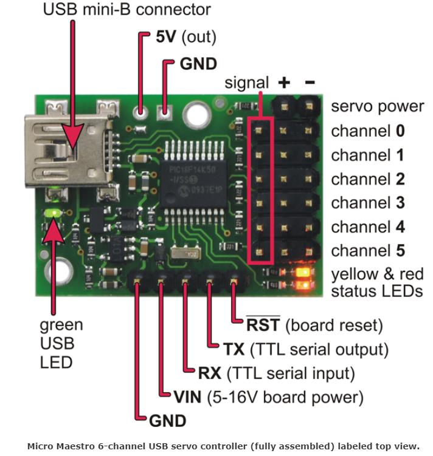
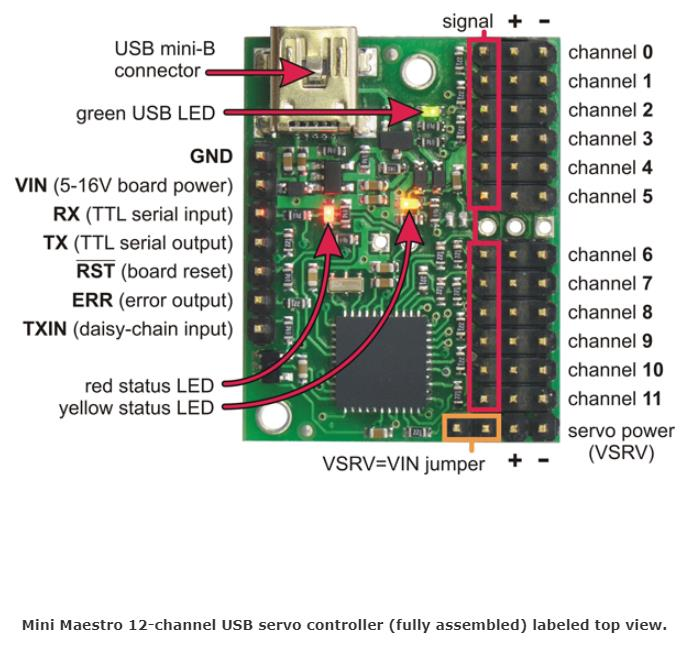
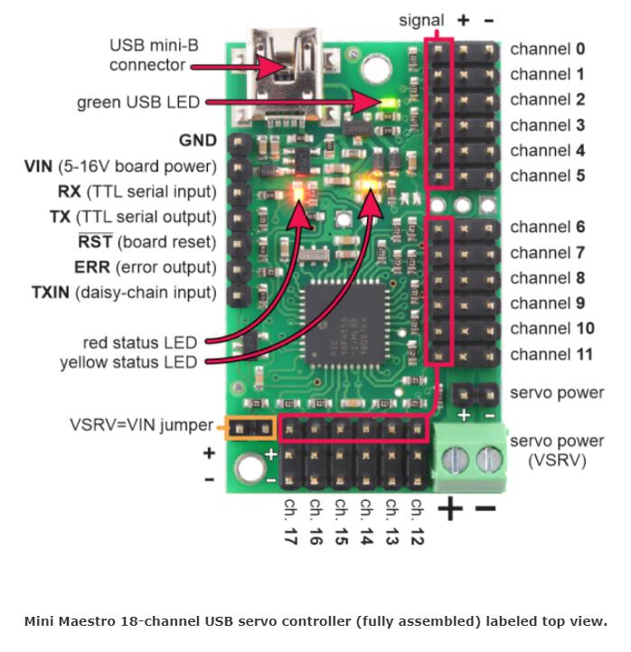
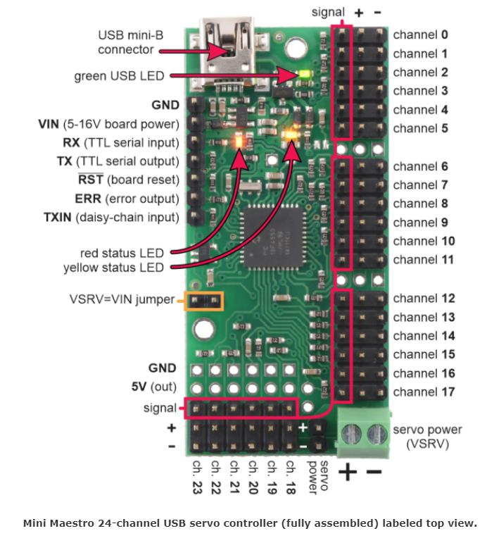
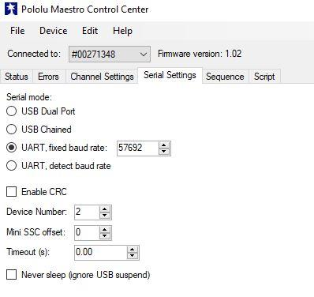

# Maestro Controllers

The Kyber Control System is compatible with various Pololu Maestro controllers, offering different channel counts and capabilities.

## Compatible Controllers

The Kyber Control System is officially compatible with all Pololu Maestro controller models. Each model offers different capabilities to suit your project needs.

## Available Models

### 6-Channel Maestro
{ align=center }

- 6 servo channels
- Compact form factor
- Ideal for small projects

### 12-Channel Maestro
{ align=center }

- 12 servo channels
- Enhanced I/O capabilities
- Medium-sized projects

### 18-Channel Maestro
{ align=center }

- 18 servo channels
- Advanced scripting capabilities
- Larger installations

### 24-Channel Maestro
{ align=center }

- 24 servo channels
- Maximum expansion capability
- Complex multi-servo projects

## Maestro Control Center

{ align=center }

The Maestro Control Center provides a user interface for:
- Channel configuration
- Script editing
- Real-time control
- Status monitoring

## Configuration Tips

!!! note "Important Settings"
    Each Maestro controller needs specific configuration for optimal performance with the Kyber Control System.

### Basic Setup
1. USB Mode Selection
2. Serial Interface Configuration
3. Channel Settings

### Advanced Features
- Script Implementation
- Daisy-Chaining
- Custom Sequences

## Questions for Clarification

!!! question "For Project Owner"
    1. Are there specific Maestro models that are preferred for the Kyber Control System?
    2. Are there any special configuration requirements for each model?
    3. What is the recommended maximum number of servos per controller in typical use?
    4. Are there any known compatibility issues with specific Maestro firmware versions?