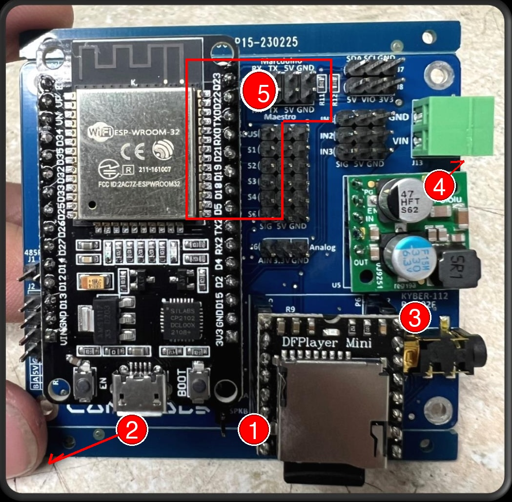
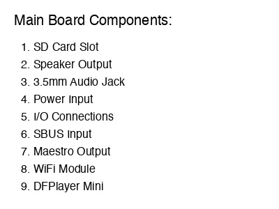

# Main Board Layout

This section provides detailed information about the Kyber Control System main board layout and connections.

## Board Overview

{ align=center }

## Connection Points

### Power Input
- **VIN**: 7.4V - 12V DC input
- **GND**: Ground connection
- **Power LED**: Indicates power status

### USB Connection
- Programming interface
- Configuration updates
- Real-time monitoring

### Servo Channels
Multiple servo connection points with:
- Power distribution
- Signal routing
- Status LEDs

## Board Legend

{ align=center }

!!! warning "Important"
    Always verify power polarity before connecting. Incorrect connections may damage the board.

## Installation Guidelines

1. Mount the board securely using provided mounting points
2. Ensure adequate ventilation
3. Keep clear of conductive materials
4. Protect from moisture and debris

## Specifications

| Feature | Specification |
|---------|--------------|
| Input Voltage | 7.4V - 12V DC |
| Max Current | 5A continuous |
| Servo Channels | Up to 6 per board |
| Size | 100mm x 60mm |
| Weight | 45g |

## Board Protection Features

- Reverse polarity protection
- Over-current protection
- Thermal shutdown
- Voltage monitoring

!!! tip "Best Practice"
    Use high-quality connectors and cables for reliable operation.

## Additional Resources

- [Wiring Guide](wiring.md)
- [Maestro Controllers](maestro-controllers.md)
- [Installation Guide](../software/installation.md)