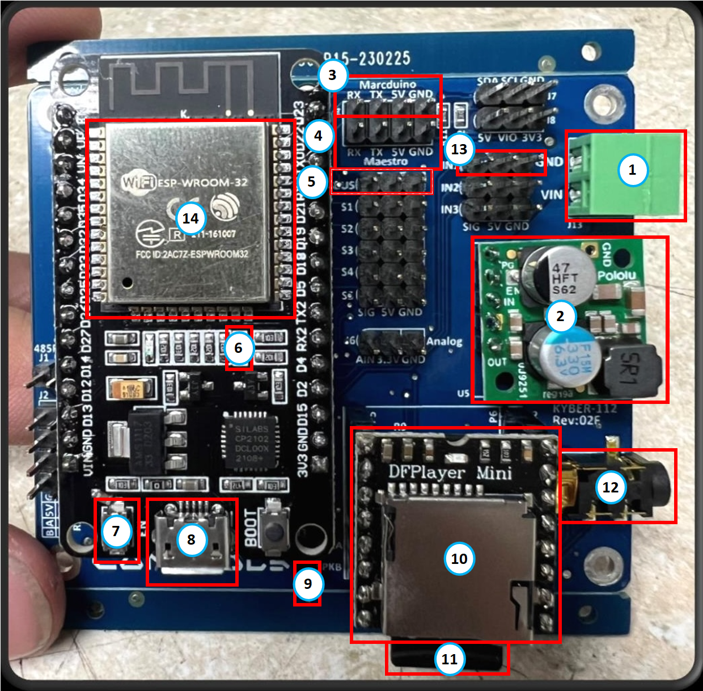

# Main Board Layout

This section provides detailed information about the Kyber Control System main board layout and connections.

## Board Overview

{ align=center }

## Main Board Layout

1. **Power Input**         - 7.5V to 36V DC
2. **Power Converter**     - 5V output, 2.5A maximum current
3. **Serial Command Port** - Send serial command to external devices (default 9600 bps)
4. **Maestro Serial Port** - Pololu Maestro control port (default 67600 bps)
5. **sBus Input Port**     - Connect receiver sBus out (16 and 24 channels support)
6. **Running LED**         - Display Kyber Status
7. **Reset Button**        - Reset Kyber. Pressing 2 time reset under 5 seconds will reset WiFi SSID and password to default.
8. **ESP32 USB Port**      - Connect a serial terminal for Real-time monitoring (default 115200 bps)
9. **Speaker Output**      - Amplified speaker output, 3W maximum
10. **DFPlayer**           - DFRobot DFPlayer device, support MP3 playback, LED will light when playing  
11. **SD Card Slot**       - Support SD card up to 16GB, place MP3 files under MP3 folder at the root of the card
12. **3.5mm Audio Jack**   - For external amplifier connection. If you experience noise in the system you may need to install a ground loop isolator between the Kyber and the amplifier
13. **WiFi Enable**        - Place a jumper or a toggle switch between **GND** and **SIG** to turn ON WiFi
14. **ESP32 Chip**         - Give your droid a Kyber heart

!!! reminder "Reminder"
     - Maximum speaker power: 3 Watts
     - Maximum 5V output current: 2.5 Amps
     - Use ground loop isolator if experiencing audio noise
     - Never exceed voltage ratings
     - Turn OFF WiFi when not in use.

!!! tip "Best Practice"
    Use high-quality connectors and cables for reliable operation.

!!! warning "Voltage Warning"
     - Always verify power polarity before connecting, incorrect connections may damage the board.
---

## Installation Guidelines

1. Mount the board securely using provided mounting points
2. Ensure adequate ventilation
3. Keep clear of conductive materials
4. Protect from moisture and debris

## Specifications

| Feature | Specification |
|---------|--------------|
| Input Voltage  | 7.5V - 36V DC |
| Max Current    | 2.5A continuous |
| Size           | 70mm x 60mm |
| Weight         | 45g |
| Servo Channels | Up to 24 per Maestro |
| sBus           | 16 and 24 channels |

## Additional Resources

- [Wiring Guide](wiring.md)
- [Maestro Controllers](maestro-controllers.md)
- [Installation Guide](../software/installation.md)