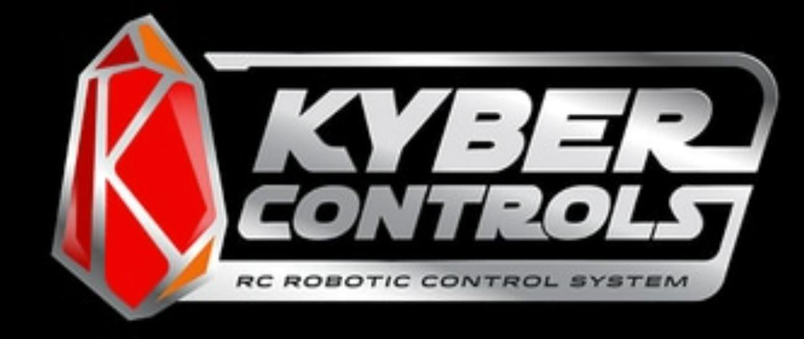

# Kyber Controls Manual

Welcome to the comprehensive manual for the Kyber Control System, an advanced RC robotic control system designed for precise servo manipulation and control.

{ align=center }

## System Overview

The Kyber Control System is a sophisticated solution for:

- Remote control of servo motors
- Sound effect management
- Precise timing control
- Web-based interface control

!!! info "Manual Version"
    This manual covers Kyber Control System Version 3.0

## Key Features

| Feature | Description |
|---------|------------|
| Servo Control | Multiple servo control channels with precise timing |
| Sound Effects | Built-in sound management system |
| Web Interface | Browser-based control interface |
| Expandability | Support for various Maestro controllers |

## Quick Start Guide

1. Review the [Hardware Setup](hardware/main-board.md)
2. Follow the [Software Installation](software/installation.md)
3. Learn [Basic Controls](usage/basic-controls.md)

!!! tip "Getting Started"
    If you're new to the Kyber Control System, we recommend starting with the [Basic Controls](usage/basic-controls.md) section.

## System Requirements

### Hardware Requirements
- Compatible Maestro controller
- Power supply (specifications in [Hardware Setup](hardware/main-board.md))
- USB connection for programming
- Servos and associated hardware

### Software Requirements
- Windows 10/11 or compatible operating system
- Modern web browser for interface control
- Internet connection for initial setup

## Support

For technical support and troubleshooting:

- Check the [FAQ](../faq.md) section
- Review [Troubleshooting Guide](usage/advanced-features.md#troubleshooting)
- Contact technical support