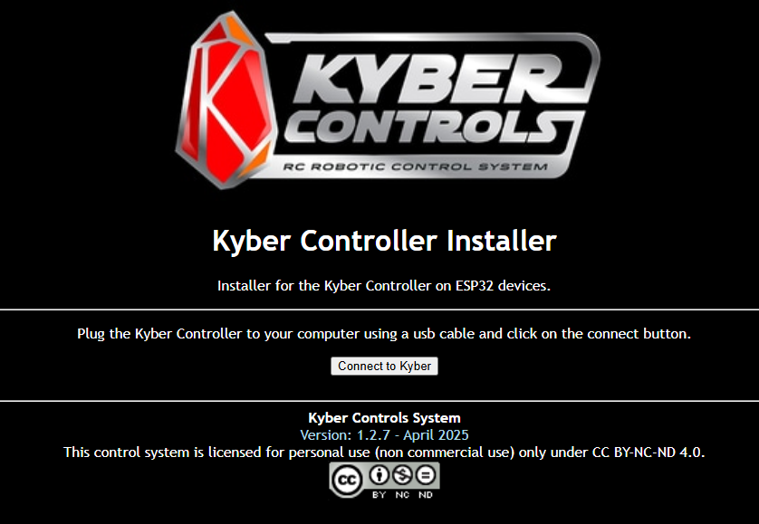
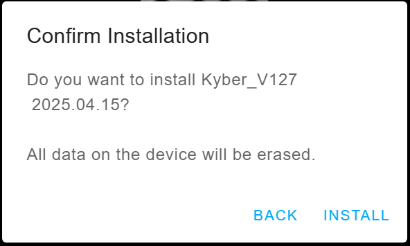
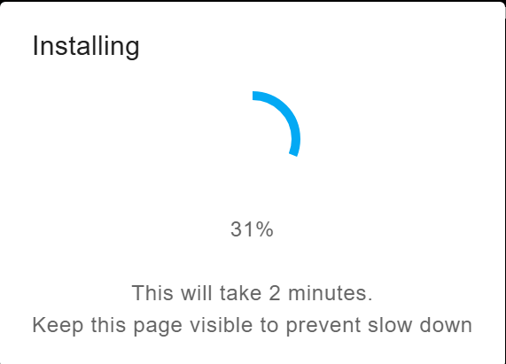
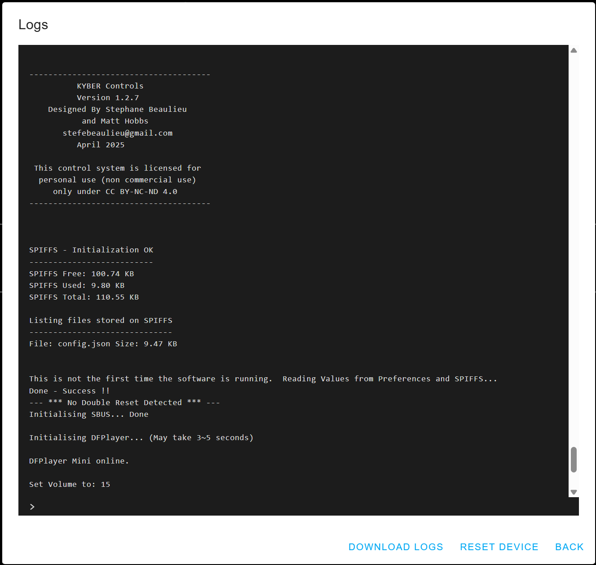
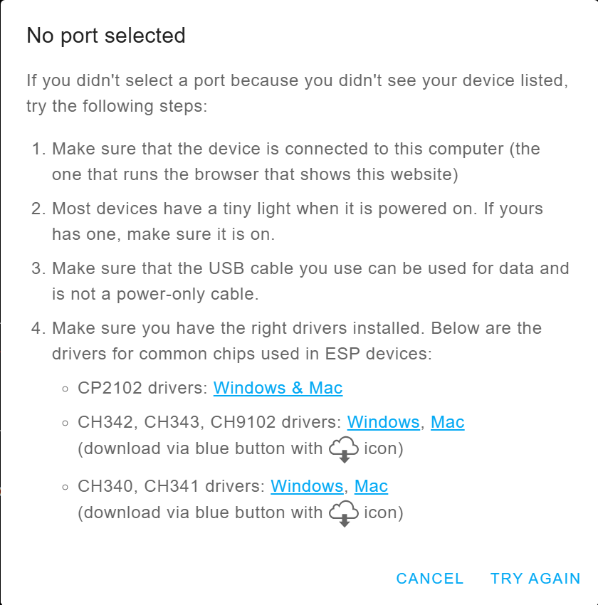
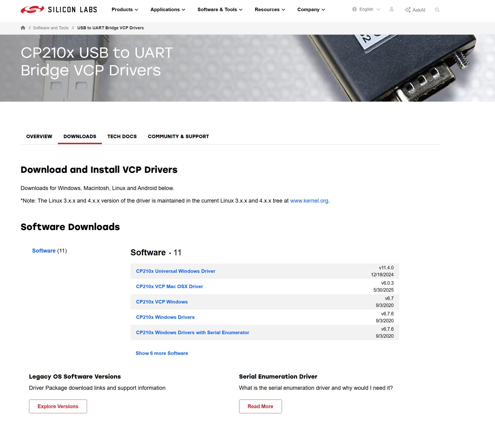

# Software Installation

## Overview

The Kyber Controller comes with software pre-installed. However, if you need to reinstall or update the firmware, the easiest method is using the web-based installer.

!!! info "Requirements"
    - Google Chrome browser (required for Web Serial API support)
    - USB cable for connection
    - Kyber Controller board

## Web Installer Guide

### Access the Web Installer

Navigate to the Kyber web installer: [https://stefe2.github.io/Kyber_Installer/](https://stefe2.github.io/Kyber_Installer/)

### Start the Installation

- Connect Your Device using a USB cable
- Click "Connect to Kyber"

- Select the COM port
- Click "Connect" to begin the installation process

- Click "Install Kyber_V127"

- Select "Erase Device"
- Click "NEXT"

- Click "INSTALL"

- Monitor the installation progress - do not disconnect during this process

- Click "NEXT"

- At this point the new firmware is installed
- You can click "LOGS & CONSOLE" to display the logs from the Kyber

- Installation completed successfully

## Error Messages

### Missing Driver

- Follow the instructions to add the ESP32 driver to your system

- Access Sillicon Lab web site to download and install the driver

!!! warning "Important Notes"
    - Do not disconnect the USB cable during installation
    - Ensure stable power supply throughout the process
    - Close other applications using the serial port
    - If installation fails, try a different USB cable or port

!!! note "Browser Support"
    Google Chrome is mendatory to flash an esp32

## Questions for Clarification (To do)

!!! question "For Project Owner"
    1. What is the current software version number?
    2. Are there different installation packages for different Windows versions?
    3. Are there any known compatibility issues with specific Windows updates?
    4. Should we include Linux/Mac installation instructions?
    5. What troubleshooting steps should we include?