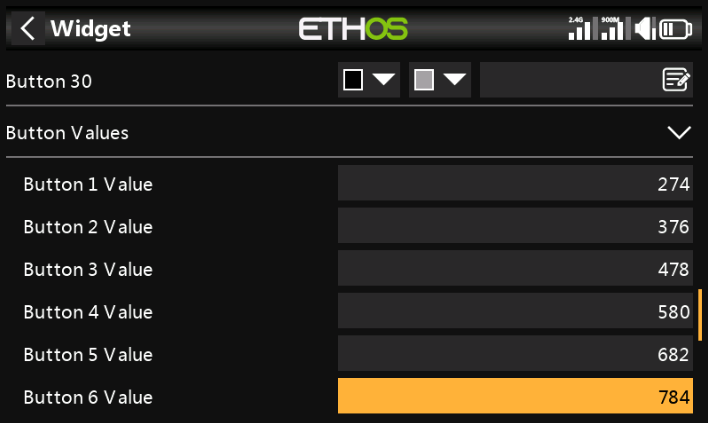
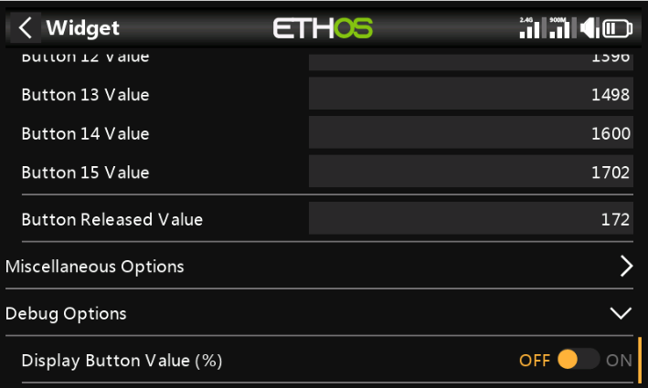

# Kyberpad V1.0
## Kyberpad Overview

The Kyberpad is designed to work with the Kyber Control System. It replace the physical 15 buttons board and remove the need to modify your remote.

It's a LUA script you install on your Tandem family remote that display the 15 buttons pad on screen and let you setup the name and color for each buttons. 

It interact with the Kyber controller via the remote touch screen. It support a toggle switch to enable a second screen that give you access to another 15 buttons.

### Main Interface

!!! info "Interface Features"
    * **Button Layout**
        - 3 rows × 5 buttons = 15 buttons per page
        - 3 pages of buttons (45 buttons total)
        - Customizable name and color for each button
    * **Status Bar** (Bottom Display)
        - Current page number
        - Random Toggle switch position
        - Software version
        - Debug information
        - Dual battery indicators from Telemetry
---

### Requirements:
- FrSky X18, X18S, X20, X20S, X20HD, XE and Twin X remote are supported.
- Your remote need to be at the latest firmware version. 
- Kyber Controller board is required. You can buy one directly from Matt Hobbs.
     - https://www.facebook.com/groups/1341505756182087

!!! note "ETHOS Version Support"
    Latest firmware version: 1.6.3 (as of 11/25)

## Radio and Receiver Update

### 1. Check Firmware Version

### 2. Update System
If your firmware is outdated:

1. **Download Required Software**
    - [Download Ethos Suite](https://ethos.frsky-rc.com/#ethossuite)
    - Watch the [Official FrSky Update Guide](https://www.youtube.com/watch?v=KmZrxfvo-OI)

2. **Update Radio Firmware**

3. **Update Receiver**
     - Follow the [Receiver Update Guide](https://youtu.be/j7TQgJl_BXE?si=59ew4u_Aw6H1Fmrk) to flash your receiver

---

## Kyberpad Installation

### Installing the LUA widget
1. Download and extract the Kyberpad zip file
     - Write an email to Stephane Beaulieu stefebeaulieu@gmail.com to get the Kyberpad software 
2. On your remote
     - Plug the USB cable to your computer.
     - Chose Ethos Suite on the remote screen
3. On your remote SD card:
    - Create a new folder named "Scripts" (if not present)
    - Copy the extracted Kyberpad files into "Scripts"
4. Restart Remote    
    - Unplug USB cable
    - Long press power button (shutdown)
    - Press again to turn it back on

---

## Model Setup

### 1. Create New Model

1. **Choose Model Type**

     - Select "Other" as your model type - this avoids unnecessary default settings

2. **Name Your Model**

     - Give your model a memorable name

### 2. Enable Kyberpad LUA Source

1. **Access Model Settings**

     - Tap the Airplane icon on the lower screen to access model settings

2. **Enable LUA**

     - Swipe left to page 2, then tap the LUA box

3. **Activate Kyberpad Source**

     - Enable the Kyberpad Source option

### 3. Configure Widget

1. **Add Widget**

     - Tap the middle lower button (+ in box), then tap + at top left

2. **Set Display Mode**

     - Select "Full Screen" for optimal display

3. **Select Widget Type**

     - Click "Change widget"

4. **Choose Kyberpad**

     - Scroll down and select Kyberpad from the list

### 4. Configure Control Switches

1. **Set Page Toggle Switch**

     - Tap on "Toggle Source: Button Pad" down arrow

2. **Select Toggle Switch**

     - Toggle the switch you want to use on the remote

3. **Configure Other Switch**
    - Use the same process to setup random mode and and wifi switch

### 5. Configure Buttons

1. **Buttons Label**

     - Tap on "Label Texte" to bring up the keyboard
     - Label your Button (use "_" to)

2. **Buttons Color**

     - Use "FG" to change the color of your text
     - Use "BG" to change the color of the background

3. **Buttons Value**

     - You can find and edit the button values under the button labels (You should not need to edit the button values)

### 6. Other

1. ***Haptic Feedback***

     - Enable haptic feedback on button press

2. ***Debug***

     - Display buttons pwm value on screen

3. **Battery Indicator**

     - Configure battery voltage Indicator on bottom line of the screen

!!! note "To Do"
    Add Screenshot and how to.

### 6. Configure Mix Controls

This section configures how Kyberpad communicates with your system.

1. **Access Mix Settings**

     - Tap the airplane button on the main screen
     - Select "Mixes" from the menu

2. **Create New Mix**

     - Select "Free Mix" as your control type

3. **Name the Mix**

     - Enter "Kyberpad" as the mix name for easy identification

4. **Configure Source**

     - Set up the input source:
         - Open the Source dropdown menu
         - Scroll down to find the LUA option
         - Select LUA as your source

5. **Verify Source Selection**

     - Note: It's normal for the Kyberpad source to appear grayed out

6. **Set Output Channel**

     - Click on "Output1", Channel list will appear

     
         - Name and configuration will be assigned to the selected channel

!!! info "Channel Selection Guide"
    Choose your output channel based on your setup:

    - SBUS 16 users: Choose from channels 1-16
    - SBUS 24 users: Choose from channels 1-24
    - Make note of your selected channel for future reference

!!! tip "Additional Controls Setup"
    For movement controls:

     1. Create separate "Free Mix" entries for each function:
         - Drive system controls
         - Dome movement controls
     2. Use the same process as above
     3. Use clear, descriptive names
     4. Document your channel assignments

!!! question "Change Log"
    - **Change to Version 04**
         - Add support to : X18, X18S, XE and Twin X remotes
         - Change the default name of Btn18.png to btn01.png
    - **Change to Version 05**
         - Added Multi Model Support
    - **Change to Version 06**
         - Added WiFi ON/OFF icon on the bottom line
         - Added Random Toggle Position on the bottom line
         - Added PAD Toggle Position on the bottom line
    - **Change to Version 07**
         - Added Support for Battery 1 and 2 Voltage
         - Changed Screen Layout for X20 and X18 Family
    - **Change to Version 08**
         - Added Support for Number Field for Channel PWM Output
         - Added Release state button value
         - Changed the Configuration Layout for each Buttons
    - **Change to Version 09**
        
         **!! Thanks to Frsky Ben for it's great contribution !!**

         - Rewrite of the code to support new ETHOS version 1.6.x
         - Changed config file to read model path instead of model name to prevent conflicts from cloned models with same model name
         - Consolidated Lua Kyberpad Source into main script
         - Add support for X18RS
         - Remove widget title to prevent hidden bottom icons
         - Consolidated config vars for button settings to arrays
         - Add for loop iterations for drawing functions
         - Add inline if/then for several drawing functions
         - Add error handling for file io read/write
         - Fixed config file write to remove unnecessary new lines in button text
         - Add checks for Lua Kyberpad Source disabled
         - Fixed runonce and highlighttext variable typos
         - Changed button text multiline to split on dot instead of space
         - Add nil checks for battery function to resolve nil value errors
         - Battery Alert configuration nested into panel
         - Button Values configuration nested into panel
         - Button color and text configuration display cleaned up
         - Add debug option to display pressed button value percent
         - Changed code commenting to be compatible with LDoc
    - **Change to Version 10**
         - Changed widget parameter names to use model filename for uniqueness to prevent conflicts from multiple model files using Kyberpad lua
         - Add debug option to enable or disable Haptic button feedback
         - Bug Fixes
