# Kyberpad
## Kyberpad Overview

The Kyberpad LUA script is software made for FrSky remotes using the ETHOS operating system. It removes the need to modify the remote to add physical button PADs.

### Main Interface
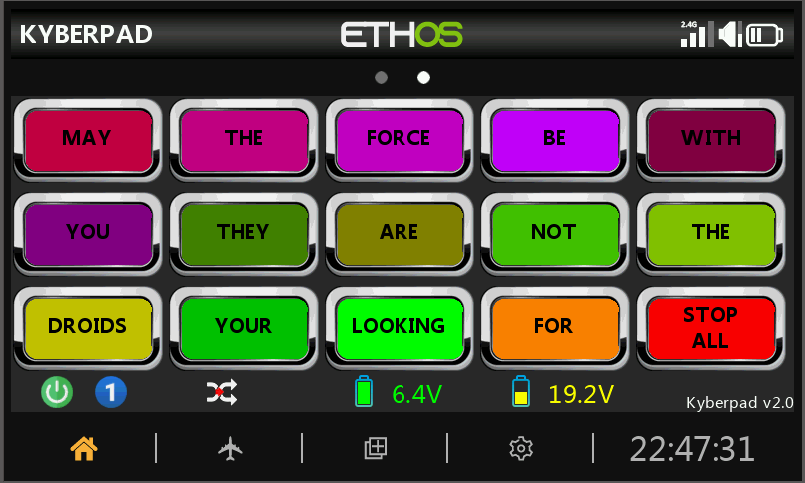
*The main Kyberpad interface showing the button layout and status display*

!!! info "Interface Features"
    * **Button Layout**
        - 3 rows × 5 buttons = 15 buttons per page
        - 3 pages of buttons (45 buttons total)
        - Customizable name and color for each button
    * **Status Bar** (Bottom Display)
        - Current page number
        - Random Toggle switch position
        - Software version
        - Debug information
        - Dual battery indicators from Telemetry
---
## Radio and Receiver Update

### 1. Check Firmware Version
!!! note "Current Version"
    Latest firmware version: 1.6.3 (as of 11/25)

*Location of the firmware version in your radio's settings*

### 2. Update System
If your firmware is outdated:

1. **Download Required Software**
    - [Download Ethos Suite](https://ethos.frsky-rc.com/#ethossuite)
    - Watch the [Official FrSky Update Guide](https://www.youtube.com/watch?v=KmZrxfvo-OI)

2. **Update Radio Firmware**

*The Ethos Suite interface for updating your radio*

3. **Update Receiver**
!!! tip "Receiver Update"
    Follow the [Receiver Update Guide](https://youtu.be/j7TQgJl_BXE?si=59ew4u_Aw6H1Fmrk) to flash your receiver through the transmitter's USB connection

---

## Kyberpad Installation

### Installing the LUA widget
1. Download and extract the Kyberpad zip file
2. On your radio's SD card:
    - Create a new folder named "Scripts"
    - Copy the extracted Kyberpad files into this folder

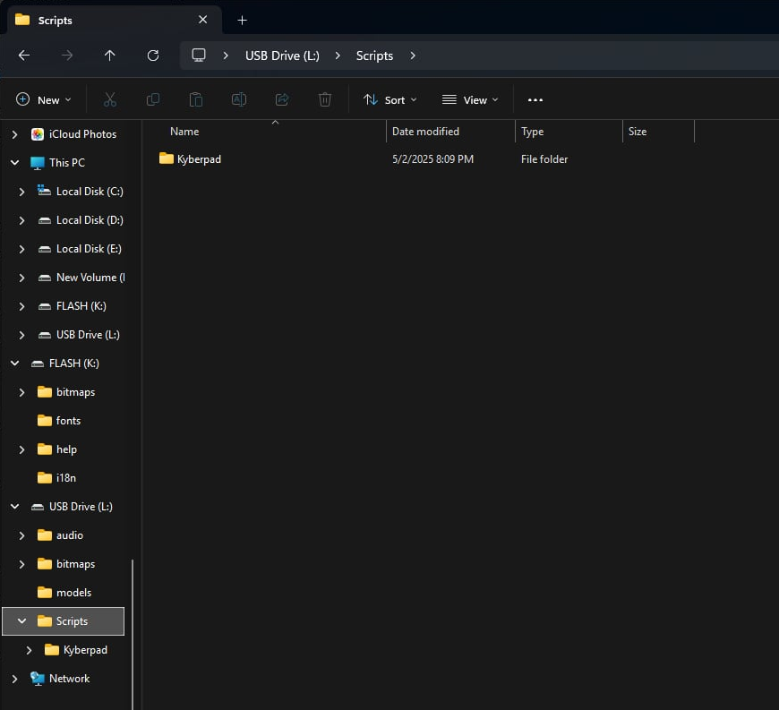
*Location of the Scripts folder on your radio's SD card*

---

## Model Setup

### 1. Create New Model

1. **Choose Model Type**

*Select "Other" as your model type - this avoids unnecessary default settings*

2. **Name Your Model**
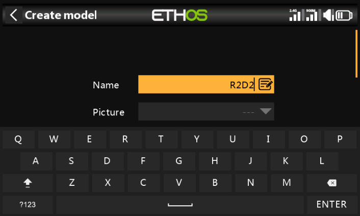
*Give your model a memorable name*

### 2. Enable Kyberpad LUA Source

1. **Access Model Settings**

*Tap the Airplane icon on the lower screen to access model settings*

2. **Enable LUA**
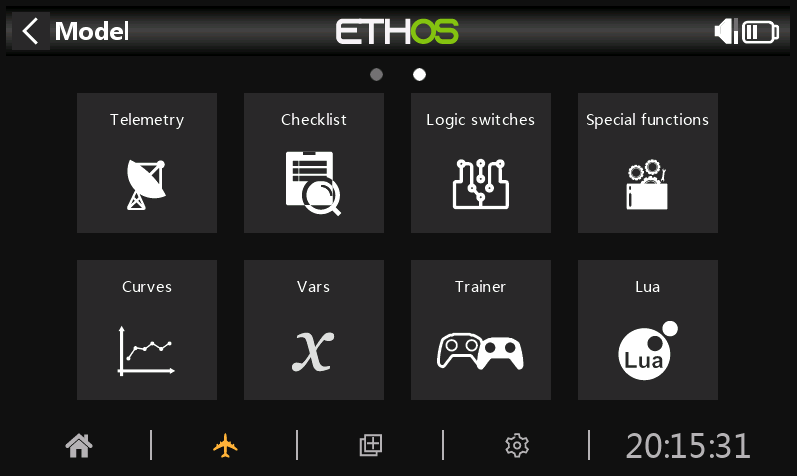
*Swipe left to page 2, then tap the LUA box*

3. **Activate Kyberpad**

*Enable the Kyberpad Source option*

### 3. Configure Widget

1. **Add Widget**
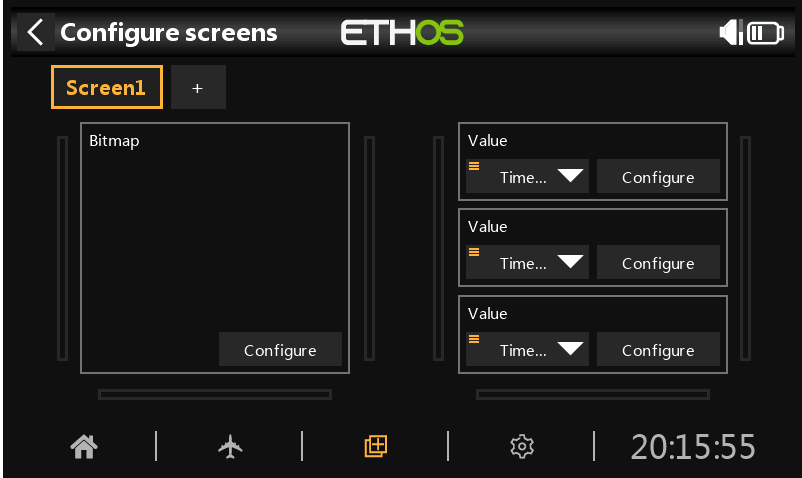
*Tap the middle lower button (+ in box), then tap + at top left*

2. **Set Display Mode**

*Select "Full Screen" for optimal display*

3. **Select Widget Type**

*Click "Change widget"*

4. **Choose Kyberpad**
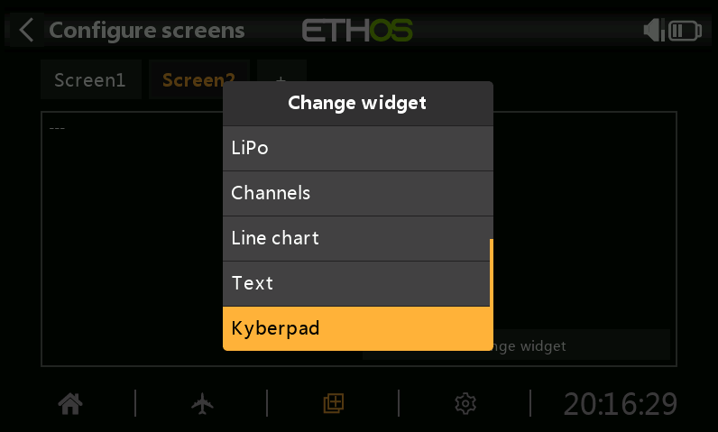
*Scroll down and select Kyberpad from the list*

### 4. Configure Control Switches

1. **Set Page Toggle Switch**

*Configure the switch for changing Kyberpad pages:*
- Open the Kyberpad widget
- Find the Toggle source dropdown
- Select a 2 or 3-position switch for page navigation

2. **Configure Random Mode Switch**
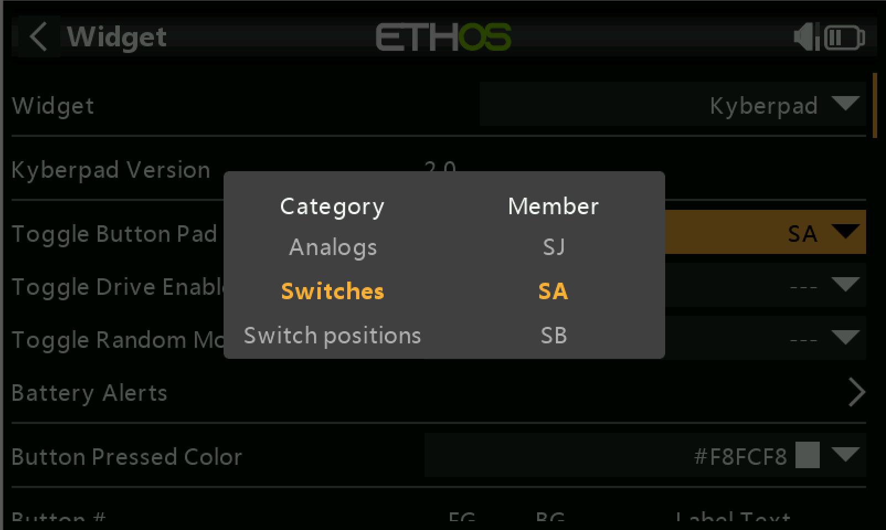
*Set up the random mode switch using the same process*

### 5. Configure Mix Controls

!!! note "Channel Setup"
    This section configures how Kyberpad communicates with your system.

1. **Access Mix Settings**

*To begin mix configuration:*
- Tap the airplane button on the main screen
- Select "Mixes" from the menu

2. **Create New Mix**
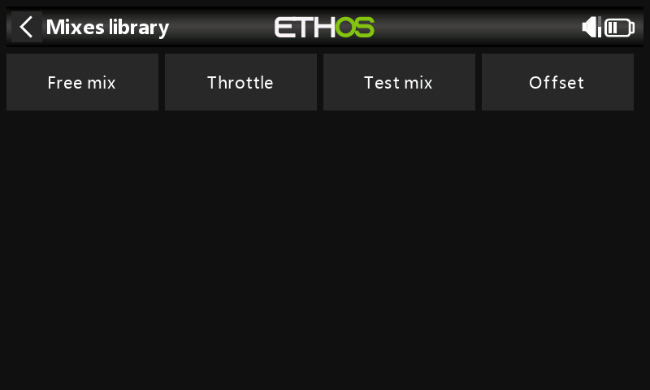
*Select "Free Mix" as your control type*

3. **Name the Mix**
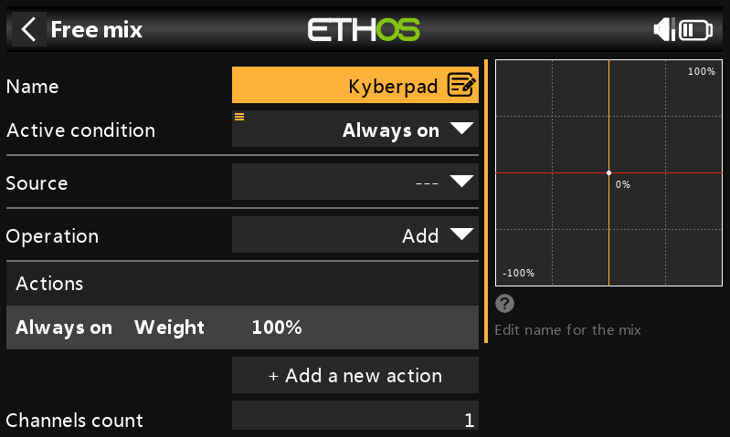
*Enter "Kyberpad" as the mix name for easy identification*

4. **Configure Source**
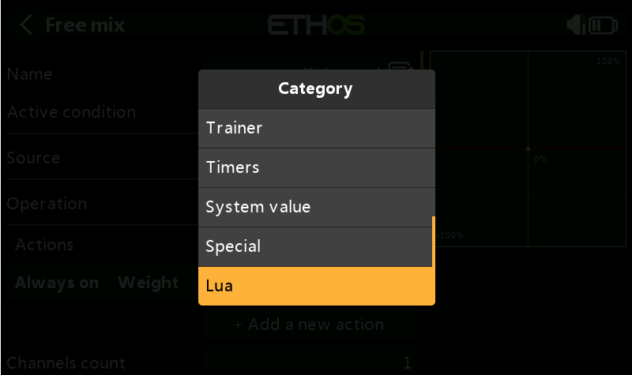
*Set up the input source:*
- Open the Source dropdown menu
- Scroll down to find the LUA option
- Select LUA as your source

5. **Verify Source Selection**

*Note: It's normal for the Kyberpad source to appear grayed out*

6. **Set Output Channel**
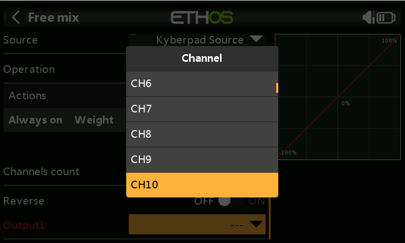

!!! info "Channel Selection Guide"
    Choose your output channel based on your setup:

    - SBUS 16 users: Choose from channels 1-16
    - SBUS 24 users: Choose from channels 1-24
    - Make note of your selected channel for future reference

!!! tip "Additional Controls Setup"
    For movement controls:

     1. Create separate "Free Mix" entries for each function:
         - Drive system controls
         - Dome movement controls
     2. Use the same process as above
     3. Use clear, descriptive names
     4. Document your channel assignments
