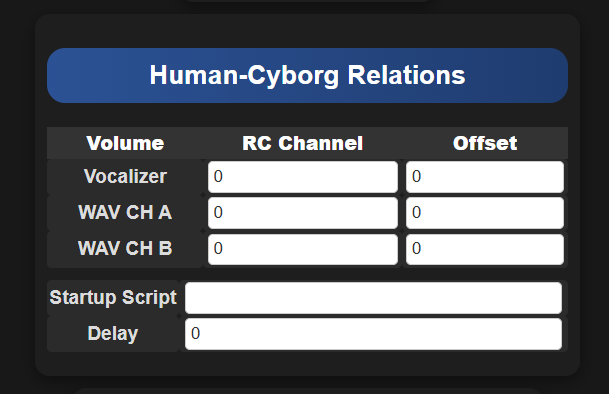
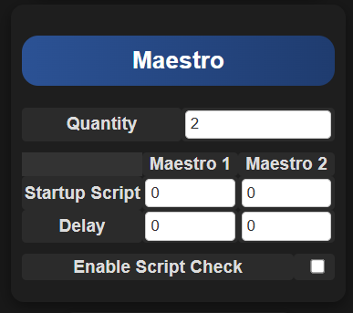
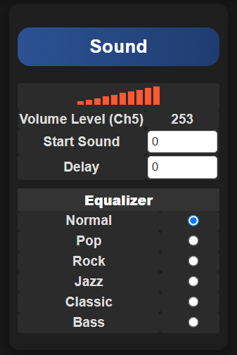
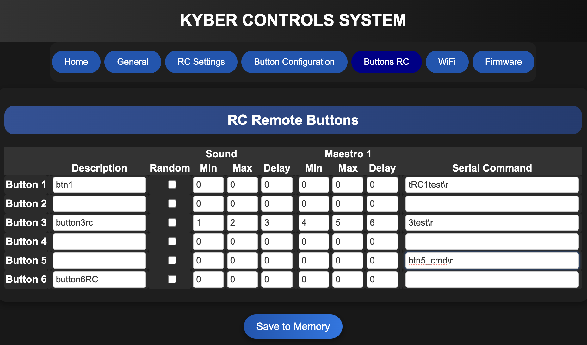
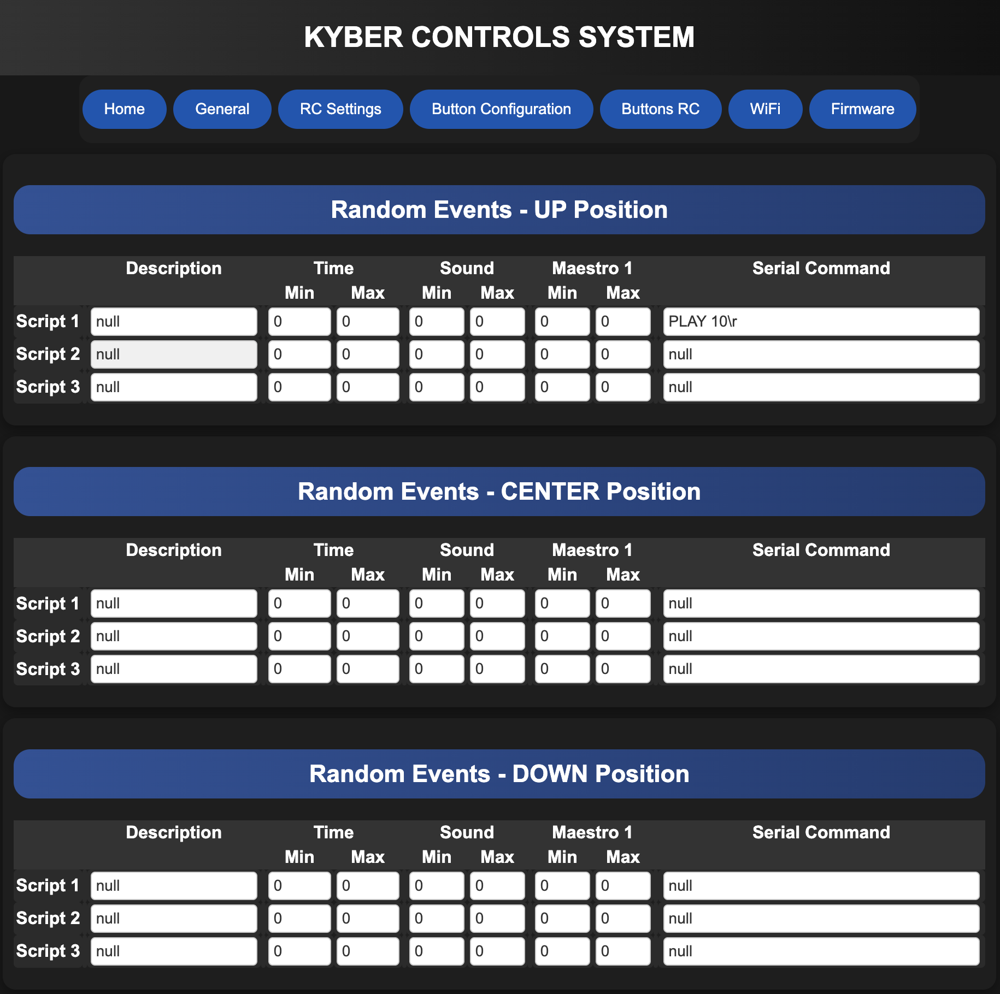

# Web Interface

The Kyber Control System provides a powerful web-based interface for configuration. The interface is designed to be intuitive and responsive, allowing you to configure your system from any supported web browser.

{ align=center }

!!! note "Interface Overview"
    Top menu provides quick access to all major functions of the system.  
    The web interface will adjust dynamically to your configuration.

## Browser Compatibility

The web interface is officially supported on:

- Google Chrome (Recommended)
- Internet Explorer
- Safari

!!! tip "Browser Recommendation"
    For the best experience, we recommend using Google Chrome as it provides optimal performance and compatibility.

## General Page

The General Page is where you will do the basic configuration of the Kyber Controller

{ align=center }

### Features

#### Serial Command
Enables sending commands via the serial port "Marcduino on the Kyber Board" to any devices that support this type of connexion.

#### Human Cyborg Relations (HCR)
When enabled and saved, this will add HCR configuration menu in General page.  Connexion to the HCR will be with the same Serial port "Marcduino".

---

### RC Channels Settings

#### Button PAD
Enter RC channel for the External Button PAD or Kyberpad.

#### Toggle for PAD 2
Enter RC channel to switch between Button PAD 1 and PAD 2.  This will be set on a 2 position toggle switch.

#### Volume Control
Enter RC channel to control volume.  This will be set on a slider or POT on the remote.

#### Buttons 1-2 3-4 5-6
Enter RC channel to act like a set of 2 buttons.  This wil be set on a 3 positions toggle switch for each channels. (See Buttons RC section)

#### Random On/Off
Enter RC channel to enable Random sounds and events.  This will be set on a 3 positions toggle switch. (See Random Section for more Info)

---

### Maestro
Enter how many Maestro you will be using. Kyber support 1 or 2 Maestro, from 6 to 24 channels.

---

### Sound
If no RC channel is set for sound you can adjust Volume level from 0 to 30.

Start Sound will be played when the Kyber boot and you can add a Delay.

You can set the Equalizer to your liking.  This is a feature built in the DFPlayer.

---

### Registration
Add the name of your droid or your own name.  This will be displayed in the footer part of the web interface.

---

{ align=center }

#### HCR menu:

Set a RC channel to control volume.  You can use the same channel for all 3.

Set an offset to adjust the sound level for each HCR channels.

Set a startup Scrip to send a command to HCR when the Kyber boot.

Set a delay before sending the startup script.

---

{ align=center }

#### Maestro menu:

Set a startup script for Maestro 1 and/or 2 who will be run when the Kyber boot.  You can set a delay.

Enable Script Check will be used to check if a script is already running before starting a new one.  If a script is running the new one will not start and the running script will be able to finish all the sequnence.

---

{ align=center }

#### Sound menu:

Once the RC channel is set the control will display the sound level.  All the other settings are the same.

Features

- Serial Command - By enabling this feature, you will be able to enter a command to send via the serial port to any devices who can receiver serial commands. 
- Human Cyborg Relations - By enabling this feature, a new menu item will be displayed in the General Page where you will be able to configure the HCR.

{ align=center }

2. **Channel Overview**
   - Real-time servo positions
   - Channel status indicators
   - Quick position adjustments
   - Group status display

3. **Alert Panel**
   - System notifications
   - Error messages
   - Warning indicators
   - Status updates

### Control Panel

#### RC Channels
{ align=center }

The RC Channels panel provides precise control over your servo channels:

- Real-time position control
- Channel status monitoring
- Individual channel configuration
- Quick position adjustments

#### Button Controls
{ align=center }

The button control interface allows for:
- Quick preset positions
- Customizable button actions
- Instant command execution
- Sequence triggering

#### Random Movement
{ align=center }

The random movement feature enables:
- Automated position changes
- Customizable movement ranges
- Timing control
- Pattern generation

### Configuration

#### General Settings
{ align=center }

The general settings panel allows you to configure:
- System preferences
- Default values
- Operation modes
- Interface options

#### WiFi Configuration
{ align=center }

The WiFi configuration panel provides:
- Network setup
- Connection management
- Security settings
- Signal strength monitoring

#### Firmware Management
{ align=center }

The firmware section enables:
- System updates
- Version management
- Update history
- System recovery options

## Mobile Interface
{ align=center }

The interface automatically adapts to mobile devices:

1. **Touch-Optimized Controls**
   - Large touch targets
   - Swipe gestures
   - Pull-to-refresh
   - Touch-friendly sliders

2. **Mobile Layout**
   - Compact navigation
   - Collapsible panels
   - Quick action buttons
   - Optimized performance

!!! tip "Mobile Usage"
    When using a mobile device:
    
    - Use landscape orientation for better control
    - Enable screen rotation lock for stability
    - Use two-finger gestures for precise adjustments
    - Consider using a tablet for complex operations

## Keyboard Shortcuts

| Key Combination | Action |
|----------------|--------|
| Space | Emergency Stop |
| Arrow Up/Down | Fine Position Adjust |
| 1-9 | Select Channel |
| Ctrl + S | Save Settings |
| Ctrl + P | Play Sequence |

## Questions for Clarification

!!! question "For Project Owner"
    1. What is the default web interface port?
    2. Are there different user access levels?
    3. What browsers are officially supported?
    4. Should we include custom UI customization instructions?
    5. Are there mobile apps available?

## Accessing the Interface

### Local Access

1. Open a supported web browser
2. Navigate to `http://localhost:8080` (default address)
3. The interface will load automatically (no login required)

!!! note "Default Port"
    The default port is 8080. If you need to change this, you can modify it in the system settings.

### Remote Access

To access your Kyber Control System from outside your local network:

1. Configure port forwarding on your router:
   - Forward port 8080 (or your custom port) to your Kyber system
   - Use TCP protocol
   
2. Access via external IP:
   - Find your external IP address
   - Use `http://your-external-ip:8080`

!!! warning "Security Notice"
    When enabling remote access:
    
    - Use a firewall to restrict access
    - Consider using a VPN for secure remote connections
    - Regularly update your system firmware