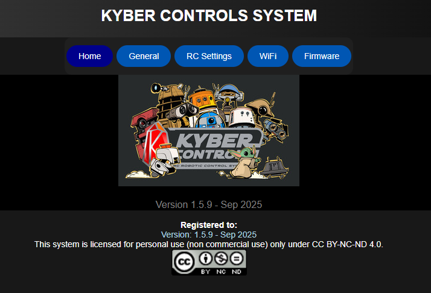
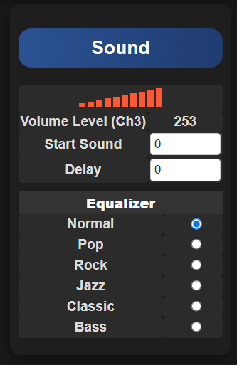

# Web Interface

The Kyber Control System features a powerful web-based interface for system configuration. This interface is designed to be both intuitive and responsive, enabling you to configure your system from any supported web browser.

!!! info "Interface Overview"
    - The top menu bar provides quick access to all major system functions
    - Interface elements automatically adjust based on your configuration settings
    - Clean, modern design for easy navigation and control

## Browser Support

The web interface is officially tested and supported on these browsers:

- Google Chrome
- Microsoft Edge
- Safari

!!! hint "Mobile Device Tips"
    When accessing the interface on mobile devices:
    
    1. **Orientation**
        - Use landscape mode for better control
        - Enable screen rotation lock for stability
    
    2. **Device Choice**
        - Tablets are recommended for complex operations
        - Larger screens provide better access to all controls

!!! warning "Important: Save Your Changes"
    Always click the "Save to Memory" button after modifying settings. Changes will be lost if you navigate away without saving.

---

## General Configuration

The General page is your starting point for configuring the Kyber Controller. Begin here to set up your system's basic features and functionality.

{ align=center }

---

### Features
{ align=center }

- **Serial Command**
    - Enables command transmission through the "Marcduino" serial port on the Kyber Board
    - Compatible with any device supporting serial communication @ 9600 Bps (Default)
    - Used for external device control and automation

- **Human Cyborg Relations (HCR)**
    - Activates the HCR configuration menu in the General page
    - Uses the same "Marcduino" serial port for communication
    - Enables advanced HCR features and controls

---

### RC Channel Configuration
{ align=center }

#### Basic Controls
- **Button PAD**
    - Assign RC channel for External Button PAD or Kyberpad
    - Controls main interaction interface

- **PAD Toggle**
    - Set RC channel to switch between PAD
    - Uses a 2-position toggle switch to activate PAD 2
    - Uses a 3-position toggle switch to activate PAD 3
    - Enables quick switching between control sets

- **Volume Control**
    - Designate RC channel for audio volume
    - Compatible with slider or potentiometer controls
    - Provides realtime volume adjustment

#### Advanced Controls
- **Button Pairs (1-2, 3-4, 5-6)**
    - Each pair requires one RC channel
    - Uses 3-position toggle switches
    - Functions as two separate buttons per channel
    - See "Buttons RC section" for detailed setup

- **Random Events**
    - Assign RC channel for random sound/event control
    - Uses 3-position toggle switch
    - Controls automatic event triggering
    - See "Random Section" for configuration details

---

### Maestro Configuration
{ align=center }

- **Quantity Setting**
    - Specify the number of Maestro controllers in use
    - Supports up to 2 Maestro controllers
    - Each controller can supports up to 24 channels
    - New Maestro menu appears after saving

---

### Maestro Control Settings
{ align=center }

- **Startup Script**
    - Select script to run after Kyber boot
    - Automates initial positioning
    - Customizable per Maestro

- **Startup Delay**
    - Set delay before script execution
    - Allows system stabilization
    - Time in milliseconds

#### Script Management
- **Enable Script Check**
    - Prevents multiple script overlap
    - When enabled: New scripts won't start if one is running
    - Ensures smooth motion sequences
    - Prevents conflicting movements

---

### Sound Configuration

{ width="36%" align=left }
*Manual volume control when no RC channel is assigned*

{ width="40%" align=right }
*Dynamic volume control with RC channel assignment*

#### Volume Control Options
- **Manual Control**
    - Available when no RC channel is assigned
    - Adjustable range: 0-30

- **RC Channel Control**
    - Real-time volume adjustment via RC
    - Uses slider/potentiometer input
    - Dynamic level display

- **Startup Sound**
    - Plays after boot sequence completion
    - Customizable sound selection
    - Confirms system readiness

- **Start Delay**
    - Adjustable delay before startup sound
    - Allows system initialization
    - Prevents audio cutoff

#### Audio Processing
- **Equalizer Settings**
    - Built-in DFPlayer feature
    - Preset audio profiles
    - Note: Settings are fixed in hardware

---

### Human Cyborg Relations (HCR) Configuration
{ align=center width=70% }

- **RC Channel Assignment**
    - Controls HCR volume levels
    - Single channel can control all three outputs
    - Independent volume control option available

- **Channel Offset**
    - Fine-tune volume balance between HCR channels
    - Compensates for speaker differences
    - Maintains consistent audio levels

- **Startup Script**
    - Automated startup command sequence
    - Initializes HCR systems

- **Startup Delay**
    - Adjustable startup delay
    - Ensures proper system initialization
    - Prevents audio conflicts

---

### System Registration
{ align=center width=50% }

- **Name**
     - Enter your droid's name or personal identifier
     - Appears in the web interface footer
     - Helps identify specific systems in multi-unit gattering

---

## RC Settings Configuration

The RC Settings page is the central hub for configuring your radio control channels. The interface automatically adapts based on your General page configuration.

{ align=center }

### Connection Status

!!! failure "Connection Error"
    { align=center }

    **If you see this message:**

    - Check SBUS connection between receiver and Kyber
    - Verify receiver configuration
    - Ensure proper wiring connections
    - Confirm receiver power supply

!!! success "Connection Active"
    { align=center }
    { align=center }

    **Proper SBUS connection detected:**

    - Supports both SBUS16 and SBUS24 protocols
    - Real-time channel monitoring
    - Full functionality available

---

### Button PAD Configuration
{ align=center width=75% }

- **Button PAD Mode**
    - Choose between 2 or 3-position configuration
    - 2-position: Enables two PAD configurations
    - 3-position: Enables three distinct PADs

- **Toggle Channel**
    - Shows active RC channel from General settings
    - Real-time channel status display

- **Current SBUS Value**
    - Live display of SBUS signal values
    - Updates in real-time with switch position
    - Useful for troubleshooting

- **PAD SBUS Values**
    - Configure values for PADs 1, 2, and 3
    - Set by moving toggle switch to each position
    - Input displayed values and save to memory

---

### Button Value Configuration
{ align=center width=60% }

- **Channel Values**
    - Display selected RC channel
    - Monitor SBUS values for each channel
    - Values shown in real-time

- **Button Assignment**
    - Set specific PWM values per button
    - Ensure unique values for each function
    - Test each button after configuration

- **Released State**
    - Set neutral position values
    - Ensures proper calibration
    - Prevents unwanted activation

!!! info "Setup Process"
     - Start by setting Released State
     - Push each buttons one by one and record the value
     - Save to Memory

---

### RC Channels Pass Through Configuration
{ align=center width=100% }

#### Overview
The Pass Through feature enables direct mapping between RC channels and Maestro servo outputs, providing precise control over multiple servos.

#### Configuration Options

1. **Basic Setup**
    - **Description**
        - Enter a descriptive name for each passthrough
        - Helps identify specific controls
        - Recommended for complex setups

    - **RC Channel**
        - Select input RC channel
        - Requires prior remote mixing setup
        - Maps to specific servo output

2. **Maestro Settings**
    - **Maestro ID**
        - Choose target Maestro (1 or 2)
        - Identifies specific controller
    
    - **Channel Selection**
        - Select output channel (0-23)
        - Maps to physical servo port

3. **Motion Control**
    - **PWM Limits**
        - Set minimum/maximum PWM values
        - Defines servo movement range
        - Customizable per channel

    - **Deadband Control**
        - Option to disable servo deadband
        - Enables direct servo control
        - Affects script compatibility

!!! tip "Advanced Usage Tips"
    - **Channel Flexibility**
        - Single RC channel can control multiple servos
        - Useful for synchronized movements
        - Reduces transmitter channel usage
    
    - **Direction Control**
        - Invert MIN/MAX PWM to reverse servo direction
        - No physical rewiring required
        - Maintains calibration settings
    
    - **Maestro Integration**
        - Match PWM limits with Maestro Control Center settings
        - Ensures consistent behavior
        - Prevents mechanical binding

!!! warning "Deadband Considerations"
    - **Disabling deadband:**
         - Provides more precise control
         - May affect script functionality
         - Consider carefully for automated sequences

!!! example "Configuration Example"
     - **Servo #1:**
         - Connected to: Maestro #1, Port 5
         - Controlled by: RC Channel #1
         - Standard configuration
     - **Servo #2:**
         - Connected to: Maestro #2, Port 6
         - Controlled by: RC Channel #2
         - Deadband: Disabled
         - Note: Cannot be controlled by scripts

---

## Button Configuration

The Button Configuration page is the heart of the Kyber Controller, where you assign specific functions and behaviors to each button.

{ align=center width=100% }

### PAD Selection and Basic Setup

#### PAD Access
- Choose between PAD 1-3 (based on configuration)
- Each PAD provides independent button settings
- Customize functions per PAD

#### Button Properties
1. **Name**
    - Assign descriptive names to buttons
    - Helps track button functions
    - Supports clear documentation

2. **Sound Configuration**
    - **MIN/MAX Sound**
        - Set sound range for button
    
    - **Sound Timing**
        - Adjust playback delay
        - Synchronize with actions
        - Fine-tune timing

    - **Random Playback**
        - Uses MIN/MAX range
        - Prevents repetition

3. **Motion Control**
    - **Primary Script**
        - Set main Maestro script
        - Define initial action
    
    - **Secondary Script**
        - Set follow-up script
        - Create action sequences
    
    - **Script Timing**
        - Add execution delay
        - Sync with sound effects

4. **Advanced Features**
    - **Serial Commands**
        - Send custom commands
        - Must end with "\r"
        - Direct external device control

    - **Emergency Stop**
        - Available on all PADs
        - Immediate action/sound stop
        - Optional serial command

!!! tip "Sound Configuration Tips"
    1. **Single Sound Mode**
        - Set identical MIN/MAX values
        - Ensures consistent playback
        - Perfect for specific effects
    
    2. **Timing Optimization**
        - Use delays for synchronization
        - Match sound with motion
    
    3. **Random Sound Tips**
        - Enable for dynamic behavior
        - Set appropriate range
        - Avoid repetitive sounds

!!! tip "Script Management Tips"
    1. **Sequence Control**
        - Scripts play in order
        - Use same value for identical playback
        - Plan script numbers in Maestro carefully
    
    2. **Timing Control**
        - Delays help synchronization
        - Adjust for smooth operation

!!! example "Configuration Examples"

     - **Example 1: Door Control**
         - Button 1 Configuration:
             - Sound: #1 (plays every press)
             - Script 1: Door open sequence
             - Script 2: Door close sequence
             - Result: Alternates between open/close

     - **Example 2: Random Sounds**
         - Button 2 Configuration:
             - Sound MIN: 5
             - Sound MAX: 10
             - Random: Enabled
             - Result: Non-repeating random sounds

     - **Example 3: Synchronized Action**
         - Button 3 Configuration:
             - Name: "The Wave" sequence
             - Sound: #2 with delay (help sync sound and movement)
             - Serial Command: Play "The Wave" on Marcduino
             - Result: Synchronized motion/sound on external device

---

## Random Events System

The Random Events system allows you to create automated, randomized behaviors for your Droid.

{ align=center }

### Toggle Switch Configuration
{ align=center width=75% }

- **Current Value Display**
    - Shows live SBUS values
    - Updates with toggle switch movement
    - Used for calibration

- **Position Settings**
    - UP: Configure upper toggle switch position pwm value
    - CENTER: Set middle toggle switch position pwm value
    - DOWN: Set lower toggle switch position pwm value

### Event Configuration
{ align=center width=100% }

#### Common Settings
Each position (UP/CENTER/DOWN) shares these configuration options:

1. **Basic Setup**
    - **Run Once Mode**
        - Single execution per trigger
        - Ideal for initialization events
        - Resets with position change

    - **Event Description**
        - Name/describe the event
        - Track different configurations
        - Document behavior

2. **Timing Control**
    - **Minimum Time**
        - Shortest interval (seconds)
        - Sets lower timing bound
    
    - **Maximum Time**
        - Longest interval (seconds)
        - Sets upper timing bound

3. **Action Configuration**
    - **Sound Range**
        - MIN: Lowest sound number
        - MAX: Highest sound number
        - Creates variety in audio

    - **Script Range**
        - MIN: First script number
        - MAX: Last script number
        - Enables varied movements

    - **Serial Commands**
        - Custom command strings
        - Must end with "\r"
        - Direct device control

!!! tip "Configuration Tips"
    1. **Random Behavior**
        - Set different MIN/MAX values
        - Creates unpredictable patterns
        - Adds life-like variation
    
    2. **Timing Strategy**
        - Consider overall system timing
        - Avoid overlapping events
        - Plan for smooth operation

!!! example "Configuration Examples"

     - **Example 1: Random Ambient Behavior**
    
         Configuration:

         - Time: 15-30 seconds
         - Sounds: 10-15 (random)
         - Scripts: 3-6 (random)
    
         Result: 
         
         - Regular, varied ambient activity and sounds

     - **Example 2: Periodic Sound**
    
         Configuration:

         - Time: 60-120 seconds
         - Sound: 20 (fixed)

         Result:

         - Periodic Sound between 60 and 120 seconds

     - **Example 3: Quick Sound**
    
         Configuration:

         - Time: 5 seconds (fixed)
         - Sound: 1 (fixed)

         Result:
         
         - Same sound every 5 seconds

!!! warning "Performance Note"
    - Test timing combinations thoroughly
    - Avoid overwhelming the system

---

## RC Buttons

!!! info "To Do"
    Add pictures and description

---

## WiFi Configuration

Configure your Kyber's wireless connectivity for local or network access.

{ align=center }

### Connection Modes

#### 1. Access Point (AP) Mode
Direct connection to the Kyber's built-in WiFi network.

- **Default Configuration**
    - SSID: `KYBER_xxxx` (xxxx = last 4 MAC address digits)
    - Password: `12345678`
    - IP Address: `192.168.4.1`

#### 2. Station Mode
Connect the Kyber to your existing WiFi network.

- **Required Information**
    - Your network's SSID
    - Network password
    - DHCP-assigned IP address

### Connection Guide

#### AP Mode Setup
1. **Device Connection**
    - Connect to `KYBER_xxxx` network
    - Use default password `12345678`
    - Wait for connection

2. **Interface Access**
    - Open web browser
    - Navigate to `http://192.168.4.1`
    - Interface loads automatically

#### Station Mode Setup
1. **Network Connection**
    - Enter your network details
    - Save configuration
    - Wait for connection

2. **Finding IP Address**

    Method:

    1. Connect USB cable
    2. Open serial console (115200 bps)
    3. Press reset button
    4. Note displayed IP address

3. **Accessing Interface**
    - Open web browser
    - Enter noted IP address
    - Interface loads automatically

### Security Recommendations

!!! danger "Critical Security Steps"
    1. **Initial Setup**
        - Change default password immediately
        - Consider changing default SSID
        - Document new credentials safely
    
    2. **Usage Guidelines**
        - Disable WiFi when not in use
        - Use WiFi switch for physical control
        - Regular password updates recommended

!!! warning "Safety Features"
    - Auto-fallback to AP Mode if network unavailable
    - Password recovery via reset button
    - Connection status indicators

!!! tip "Troubleshooting Guide"
    1. **Network Not Found**
         - Check WiFi switch/jumper
         - Verify power to WiFi module
         - Confirm correct SSID

    2. **Connection Issues**
         - Verify credentials
         - Check signal strength
         - Confirm router settings

    3. **Password Reset**
         - Press reset button twice
         - Hold 5-6 seconds each press
         - SSID resets to KYBER_xxxx
         - Password resets to 12345678
        

!!! info "Network Selection Tips"
    - Kyber only support 2.4GHz networks
    - Avoid crowded networks
    - Place your RC remote and receiver away from the Kyber

---

## Firmware Management
{ align=center }

#### Firmware Update

- Chose the latest Kyber bin file to update your system
- Click Update Firmware
- Once at 100% Kyber will reboot
- Navigate to `http://192.168.4.1`

#### Check Online for Update

- This will be enabled at a later time

#### System Recovery

- Right click on config.json and save file to your PC
- Chose a previously saved config.json file to reload configuration
- Click Update to enable new config
- Clear Config will reset the Kyber to factory default

#### System Control

- Click Reboot System to reboot the Kyber

!!! info "Support Resources To Do"
    - Documentation updates
    - Community forums
    - Technical support
    - Training materials

!!! info "Custom Title"
    This is a note admonition. The title is optional.

!!! abstract "Abstract"
    Also known as "summary" or "tldr"

!!! info "Info"
    Additional information

!!! tip "Tip"
    Also known as "hint" or "important"

!!! success "Success"
    Also known as "check" or "done"

!!! question "Question"
    Also known as "help" or "faq"

!!! warning "Warning"
    Also known as "caution" or "attention"

!!! failure "Failure"
    Also known as "fail" or "missing"

!!! danger "Danger"
    Also known as "error"

!!! bug "Bug"
    Report a bug

!!! example "Example"
    An example

!!! quote "Quote"
    Also known as "cite"