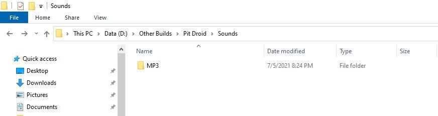
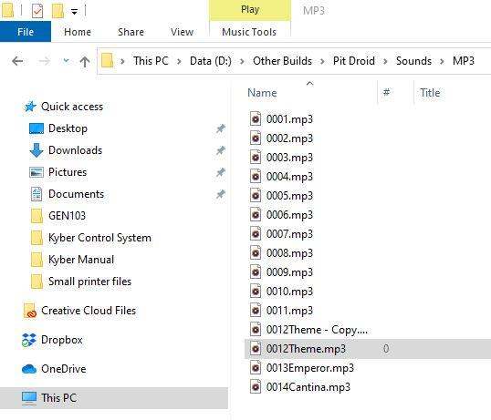

# Sound Configuration

Learn how to set up and manage sound effects in the Kyber Control System.

## Sound System Overview

### Supported Formats
- File types
- Sample rates
- Bit depths
- Compression options

### File Management
{ align=center }

- File organization
- Naming conventions
- Storage locations
- File backup

## Sound Integration

### Playback Configuration
{ align=center }

- Volume control
- Channel assignment
- Timing settings
- Loop options

!!! important "Sound Playback Limitation"
    The system supports playing one sound at a time. New sound triggers will stop the currently playing sound.

### Trigger Setup
- Event mapping
- Conditional playback
- Priority levels
- Mixing rules

## Advanced Sound Features

### Multi-Channel Audio
- Stereo setup
- Channel mixing
- Balance control
- Cross-fading

### Synchronization
- Motion sync
- Time-based triggers
- Sequence integration
- Delay settings

## Questions for Clarification

!!! question "For Project Owner"
    1. What are the recommended audio file specifications?
    2. Are there maximum file size limitations?
    3. How many simultaneous sounds can be played?
    4. Should we include audio processing tips?
    5. Are there specific sound effect examples to include?